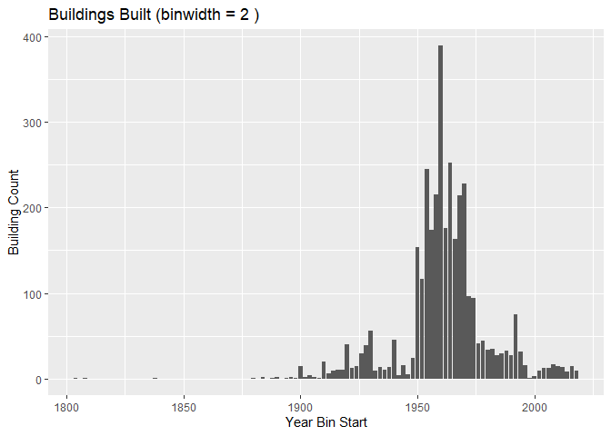
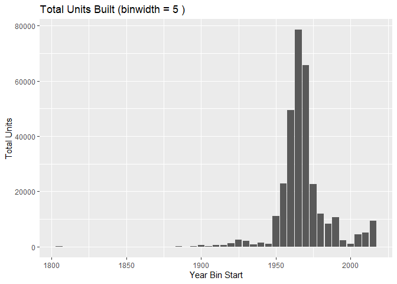
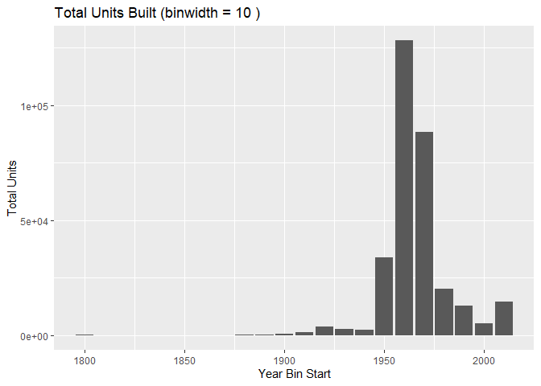
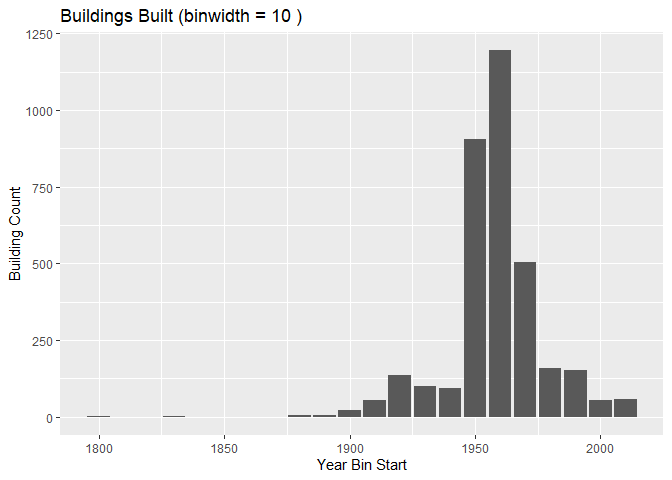
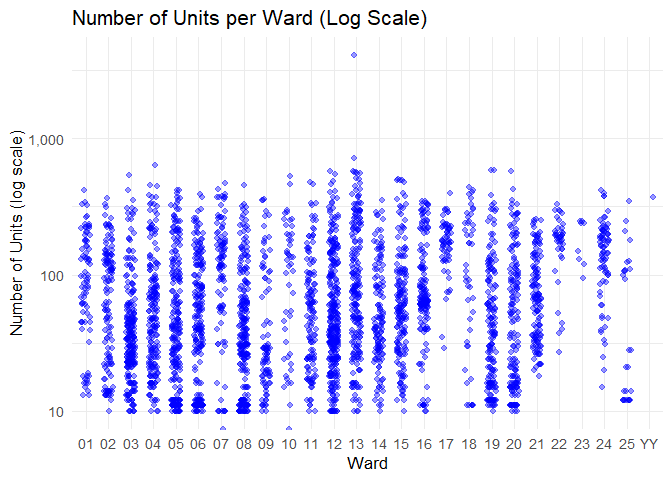
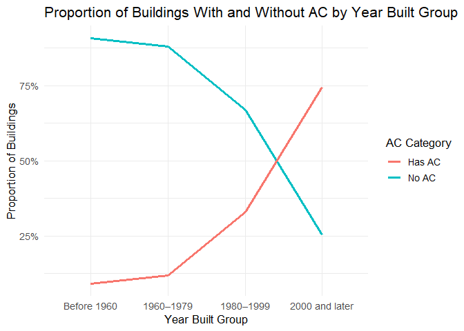

Mini Data Analysis Milestone 2
================

*To complete this milestone, you can edit [this `.rmd`
file](https://github.com/UBC-STAT/STAT545.github.io/blob/main/content/mini-data-analysis/mini-project-2.Rmd)
directly. Fill in the sections that are commented out with
`<!--- start your work here--->`. When you are done, make sure to knit
to an `.md` file by changing the output in the YAML header to
`github_document`, before submitting a tagged release on canvas.*

# Welcome to the rest of your mini data analysis project!

In Milestone 1, you explored your data. and came up with research
questions. This time, we will finish up our mini data analysis and
obtain results for your data by:

- Making summary tables and graphs
- Manipulating special data types in R: factors and/or dates and times.
- Fitting a model object to your data, and extract a result.
- Reading and writing data as separate files.

We will also explore more in depth the concept of *tidy data.*

**NOTE**: The main purpose of the mini data analysis is to integrate
what you learn in class in an analysis. Although each milestone provides
a framework for you to conduct your analysis, it’s possible that you
might find the instructions too rigid for your data set. If this is the
case, you may deviate from the instructions – just make sure you’re
demonstrating a wide range of tools and techniques taught in this class,
and indicate *why* you had to deviate. Feel free to contact the
instructor in these cases.

# Instructions

**To complete this milestone**, edit [this very `.Rmd`
file](https://github.com/UBC-STAT/STAT545.github.io/blob/main/content/mini-data-analysis/mini-project-2.Rmd)
directly. Fill in the sections that are tagged with
`<!--- start your work here--->`.

**To submit this milestone**, make sure to knit this `.Rmd` file to an
`.md` file by changing the YAML output settings from
`output: html_document` to `output: github_document`. Commit and push
all of your work to your mini-analysis GitHub repository, and tag a
release on GitHub. Then, submit a link to your tagged release on canvas.

**Points**: This milestone is worth 50 points: 45 for your analysis, and
5 for overall reproducibility, cleanliness, and coherence of the Github
submission.

**Research Questions**: In Milestone 1, you chose four research
questions to focus on. Wherever realistic, your work in this milestone
should relate to these research questions whenever we ask for
justification behind your work. In the case that some tasks in this
milestone don’t align well with one of your research questions, feel
free to discuss your results in the context of a different research
question.

# Learning Objectives

By the end of this milestone, you should:

- Understand what *tidy* data is, and how to create it using `tidyr`.
- Generate a reproducible and clear report using R Markdown.
- Manipulating special data types in R: factors and/or dates and times.
- Fitting a model object to your data, and extract a result.
- Reading and writing data as separate files.

# Setup

Begin by loading your data and the tidyverse package below:

``` r
library(datateachr) # <- might contain the data you picked!
library(tidyverse)
```

# Task 1: Process and summarize your data

From Milestone 1, you should have an idea of the basic structure of your
dataset (e.g. number of rows and columns, class types, etc.). Here, we
will start investigating your data more in-depth using various data
manipulation functions.

### 1.1 (1 point)

First, write out the 4 research questions you defined in milestone 1
were. This will guide your work through milestone 2:

<!-------------------------- Start your work below ---------------------------->

1.  what’s the relationship between number of unit and number of
    apartment built in a year. Because the built year distribution looks
    similar to number of unit per year.

2.  What kind of apartment intend to missing more value than others?

3.  there is one unit has 4000+ unit what make it so unic? Is there any
    special feature reflected on other paramete?

4.  Whats the realtionship between AC coverage rate and their built
    year. Will that be similar to number of unit distribution?
    <!----------------------------------------------------------------------------->

Here, we will investigate your data using various data manipulation and
graphing functions.

### 1.2 (8 points)

Now, for each of your four research questions, choose one task from
options 1-4 (summarizing), and one other task from 4-8 (graphing). You
should have 2 tasks done for each research question (8 total). Make sure
it makes sense to do them! (e.g. don’t use a numerical variables for a
task that needs a categorical variable.). Comment on why each task helps
(or doesn’t!) answer the corresponding research question.

Ensure that the output of each operation is printed!

Also make sure that you’re using dplyr and ggplot2 rather than base R.
Outside of this project, you may find that you prefer using base R
functions for certain tasks, and that’s just fine! But part of this
project is for you to practice the tools we learned in class, which is
dplyr and ggplot2.

**Summarizing:**

1.  Compute the *range*, *mean*, and *two other summary statistics* of
    **one numerical variable** across the groups of **one categorical
    variable** from your data.
2.  Compute the number of observations for at least one of your
    *categorical variables*. Do not use the function `table()`!
3.  Create a categorical variable with 3 or more groups from an existing
    *numerical variable*. You can use this new variable in the other
    tasks! *An example: age in years into “child, teen, adult, senior”.*
4.  Compute the proportion and counts in each category of one
    *categorical variable* across the groups of another *categorical
    variable* from your data. Do not use the function `table()`!

**Graphing:**

6.  Create a graph of your choosing, make one of the axes logarithmic,
    and format the axes labels so that they are “pretty” or easier to
    read.
7.  Make a graph where it makes sense to customize the alpha
    transparency.

Using variables and/or tables you made in one of the “Summarizing”
tasks:

8.  Create a graph that has at least two geom layers.
9.  Create 3 histograms, with each histogram having different sized
    bins. Pick the “best” one and explain why it is the best.

Make sure it’s clear what research question you are doing each operation
for!

<!------------------------- Start your work below ----------------------------->

Research Question1:

what’s the relationship between number of unit and number of apartment
built in a year. Because the built year distribution looks similar to
number of unit per year.

Task 2:

Compute the number of observations for at least one of your *categorical
variables*. Do not use the function `table()`!

Note: So here I used the count of year_built. The reason why I take
year_built here as a “categorical variables” is because the year make no
sense if you add them up or doing any math on it so even its saved as a
numver, it more represents a categorical variables just to distinguish
like 1901 and 1900. And I count the year_built because this form the key
variable in my research quetion which is “number of apartment built in a
year”. So all the following research is based on this.

``` r
year_summary <- apt_buildings %>%
  filter(!is.na(year_built)) %>%
  group_by(year_built) %>%
  summarise(
    total_units = sum(no_of_units, na.rm = TRUE),
    n_buildings = n(),
    .groups = "drop"
  )
print(year_summary)
```

    ## # A tibble: 127 × 3
    ##    year_built total_units n_buildings
    ##         <dbl>       <dbl>       <int>
    ##  1       1805          69           1
    ##  2       1809          10           1
    ##  3       1838          10           1
    ##  4       1880          13           1
    ##  5       1885          47           2
    ##  6       1888          16           1
    ##  7       1890          16           1
    ##  8       1891          16           1
    ##  9       1895          11           1
    ## 10       1896          16           1
    ## # ℹ 117 more rows

Research Question1:

what’s the relationship between number of unit and number of apartment
built in a year. Because the built year distribution looks similar to
number of unit per year.

Task 9:

Create 3 histograms, with each histogram having different sized bins.
Pick the “best” one and explain why it is the best.

Note: So I draw 3 bin size for 2 variables I’m interested in(Totally 6
graph). This is actually following the “Mask” thought I mentioned in
task3 above. Here we have a larger bin size is works as those “Mask”
that I wanna use for ignoring tiny difference. From the result shown I
would say the best mask length is 5. Cause it do minimal those tiny
difference but also is not fixing some meaningful information like the
10 graph.

``` r
year_summary <- apt_buildings %>%
  filter(!is.na(year_built)) %>%
  group_by(year_built) %>%
  summarise(
    total_units = sum(no_of_units, na.rm = TRUE),
    n_buildings = n(),
    .groups = "drop"
  )

bin_widths <- c(2, 5, 10)

for (bw in bin_widths) {
  binned <- year_summary %>%
    mutate(bin = floor(year_built / bw) * bw) %>%
    group_by(bin) %>%
    summarise(
      total_units = sum(total_units, na.rm = TRUE),
      n_buildings = sum(n_buildings, na.rm = TRUE),
      .groups = "drop"
    )
  
  p1 <- ggplot(binned, aes(x = bin, y = total_units)) +
    geom_col() +
    labs(title = paste("Total Units Built (binwidth =", bw, ")"),
         x = "Year Bin Start", y = "Total Units")
  print(p1)
  
  p2 <- ggplot(binned, aes(x = bin, y = n_buildings)) +
    geom_col() +
    labs(title = paste("Buildings Built (binwidth =", bw, ")"),
         x = "Year Bin Start", y = "Building Count")
  print(p2)
}
```

<!-- --><!-- --><!-- --><!-- --><!-- --><!-- -->

Research Question 2:

What kind of apartment intend to missing more value than others?

Task4:

Compute the proportion and counts in each category of one *categorical
variable* across the groups of another *categorical variable* from your
data. Do not use the function `table()`!

Note: So Here its actually the combination of task4 and 2 new created
variable called missing \_category and unit_group. So here we set a row
is complete if all information is provided and set it to missing if any
column is missing value. Unit group is based on no_of_unit and is has
small or medium or large option. And we compute the missing or complete
variables portion to each unit_group. The result shows large apartment
has 26% to have complete information while medium has 4% and small has
1% chance. Which told us larger apartment tend to have higher chance to
have complete information.

``` r
apt_buildings <- apt_buildings %>%
  mutate(
    unit_group = case_when(
      no_of_units <= 10 ~ "Small",
      no_of_units > 10 & no_of_units <= 50 ~ "Medium",
      no_of_units > 50 ~ "Large",
      TRUE ~ "Unknown"
    ),
    missing_category = if_else(rowSums(is.na(.)) > 0, "Missing", "Complete")
  )

apt_buildings %>%
  group_by(unit_group, missing_category) %>%
  summarise(count = n(), .groups = "drop") %>%
  group_by(unit_group) %>%
  mutate(prop = count / sum(count))
```

    ## # A tibble: 6 × 4
    ## # Groups:   unit_group [3]
    ##   unit_group missing_category count   prop
    ##   <chr>      <chr>            <int>  <dbl>
    ## 1 Large      Complete           465 0.265 
    ## 2 Large      Missing           1289 0.735 
    ## 3 Medium     Complete            66 0.0408
    ## 4 Medium     Missing           1551 0.959 
    ## 5 Small      Complete             1 0.0119
    ## 6 Small      Missing             83 0.988

Research Question 2:

What kind of apartment intend to missing more value than others?

Task7

Make a graph where it makes sense to customize the alpha transparency.

Note: So based on the information we get above. Here we made a
transparency graph based on the huge chance of overlapping between
complete dot and missing dot. Here we can find all the complete dot
assembles in the right half of the picture, which shows another trend
that the newer the apartment are the higher chance the complete
information it has.

``` r
ggplot(apt_buildings, aes(x = year_built, y = no_of_units, color = missing_category)) +
  geom_point(alpha = 0.4, size = 3) +
  scale_y_log10(labels = scales::comma) +
  labs(
    title = "Alpha Transparency Example: Year Built vs Number of Units",
    x = "Year Built",
    y = "Number of Units (log scale)",
    color = "Data Status"
  ) +
  theme_minimal(base_size = 13)
```

    ## Warning in scale_y_log10(labels = scales::comma): log-10 transformation
    ## introduced infinite values.

    ## Warning: Removed 13 rows containing missing values or values outside the scale range
    ## (`geom_point()`).

<!-- -->

Research Question 3:

there is one unit has 4000+ unit what make it so unic? Is there any
special feature reflected on other paramete?

Task1:

Compute the *range*, *mean*, and *two other summary statistics* of **one
numerical variable** across the groups of **one categorical variable**
from your data.

Note: I tried a few times first find the min no_of_unit has 0 so I
filtered out those.THen I have range, mean, median, min, and max here
according to their property_type. We can see the private has largest
range but common mean and has biggest 4111 unit apartment. This tells
that TCHC has averagely most unit per apartment because its 146 mean
units but private has biggest range while social housing has no obvious
feature. this helps me understand the 4111 unic feature of its property
type.

``` r
apt_buildings %>%
  filter(!is.na(no_of_units), no_of_units > 0) %>%   
  group_by(property_type) %>%
  summarise(
    range_units = max(no_of_units, na.rm = TRUE) - min(no_of_units, na.rm = TRUE),
    mean_units = mean(no_of_units, na.rm = TRUE),
    median_units = median(no_of_units, na.rm = TRUE),
    min_units = min(no_of_units, na.rm = TRUE),
    max_units = max(no_of_units, na.rm = TRUE)
  ) %>%
  arrange(desc(mean_units))
```

    ## # A tibble: 3 × 6
    ##   property_type  range_units mean_units median_units min_units max_units
    ##   <chr>                <dbl>      <dbl>        <dbl>     <dbl>     <dbl>
    ## 1 TCHC                   708      146.           128        11       719
    ## 2 PRIVATE               4101       85.6           47        10      4111
    ## 3 SOCIAL HOUSING         287       82.9           68        10       297

Research Question 3:

there is one unit has 4000+ unit what make it so unic? Is there any
special feature reflected on other parameter?

Task6:

Create a graph of your choosing, make one of the axes logarithmic, and
format the axes labels so that they are “pretty” or easier to read.

Note: So this graph the y-axis is log axis, which help better shows the
4111 no_of_unit number in this graph or it will leaves too far from
other dots in linear y axis that will make dots beblow unreadable. This
also helps me see the 4111 located in ward 13 as its feature.

``` r
ggplot(apt_buildings, aes(x = ward, y = no_of_units)) +
  geom_jitter(alpha = 0.4, color = "blue", width = 0.2) +
  scale_y_log10(labels = scales::comma) +
  labs(
    title = "Number of Units per Ward (Log Scale)",
    x = "Ward",
    y = "Number of Units (log scale)"
  ) +
  theme_minimal(base_size = 13)
```

    ## Warning in scale_y_log10(labels = scales::comma): log-10 transformation
    ## introduced infinite values.

<!-- -->

Research Question 4:

Whats the realtionship between AC coverage rate and their built year.
Will that be similar to number of unit distribution?

Task4: Compute the proportion and counts in each category of one
*categorical variable* across the groups of another *categorical
variable* from your data. Do not use the function `table()`!

Note: I can only connect this task with my research question when I
compute another categoraical variable based on year_built here as
built_group. so this gives me a view that coverage is 9%, 11%, 33% and
74% as time goes. so the newer apartment has higher coverage. It does
not like the no_of_unit distribution with built_year.

``` r
ac_summary <- apt_buildings %>%
  filter(!is.na(air_conditioning), !is.na(year_built)) %>%
  mutate(
    ac_category = if_else(air_conditioning == "NONE", "No AC", "Has AC"),
    built_group = case_when(
      year_built < 1960 ~ "Before 1960",
      year_built >= 1960 & year_built < 1980 ~ "1960–1979",
      year_built >= 1980 & year_built < 2000 ~ "1980–1999",
      year_built >= 2000 ~ "2000 and later"
    )
  ) %>%
  group_by(built_group, ac_category) %>%
  summarise(count = n(), .groups = "drop") %>%
  group_by(built_group) %>%
  mutate(proportion = count / sum(count))
print(ac_summary)
```

    ## # A tibble: 8 × 4
    ## # Groups:   built_group [4]
    ##   built_group    ac_category count proportion
    ##   <chr>          <chr>       <int>      <dbl>
    ## 1 1960–1979      Has AC        200     0.119 
    ## 2 1960–1979      No AC        1487     0.881 
    ## 3 1980–1999      Has AC        101     0.330 
    ## 4 1980–1999      No AC         205     0.670 
    ## 5 2000 and later Has AC         82     0.745 
    ## 6 2000 and later No AC          28     0.255 
    ## 7 Before 1960    Has AC        115     0.0909
    ## 8 Before 1960    No AC        1150     0.909

Research Question 4:

Whats the realtionship between AC coverage rate and their built year.
Will that be similar to number of unit distribution?

Task8: Create a graph that has at least two geom layers.

Note: So this is a more intuitive graph showing the porpotion goes along
with time. The lines are the prportion has AC with proportion with no
AC, which intuitively shows the trends answering question AC coverage
goes higher as time goes its not similar to number of unit distribution.

``` r
ac_summary$built_group <- factor(
  ac_summary$built_group,
  levels = c("Before 1960", "1960–1979", "1980–1999", "2000 and later")
)

ac_has <- ac_summary %>% filter(ac_category == "Has AC")
ac_no  <- ac_summary %>% filter(ac_category == "No AC")

ggplot() +
  geom_line(
    data = ac_no,
    aes(x = built_group, y = proportion, group = 1, color = "No AC"),
    size = 1.2
  ) +
  geom_line(
    data = ac_has,
    aes(x = built_group, y = proportion, group = 1, color = "Has AC"),
    size = 1.2
  ) +
  scale_y_continuous(labels = scales::percent) +
  labs(
    title = "Proportion of Buildings With and Without AC by Year Built Group",
    x = "Year Built Group",
    y = "Proportion of Buildings",
    color = "AC Category"
  ) +
  theme_minimal(base_size = 13)
```

    ## Warning: Using `size` aesthetic for lines was deprecated in ggplot2 3.4.0.
    ## ℹ Please use `linewidth` instead.
    ## This warning is displayed once every 8 hours.
    ## Call `lifecycle::last_lifecycle_warnings()` to see where this warning was
    ## generated.

<!-- -->

<!----------------------------------------------------------------------------->

### 1.3 (2 points)

Based on the operations that you’ve completed, how much closer are you
to answering your research questions? Think about what aspects of your
research questions remain unclear. Can your research questions be
refined, now that you’ve investigated your data a bit more? Which
research questions are yielding interesting results?

<!------------------------- Write your answer here ---------------------------->

So the question 1 about the similarity still keeps unclear on how
similar they are because no correlation analysis is done on that. For
question 2 we found the smaller apartment seems to missing more value
but the unclearness is it could be analysis from another aspects like
property-type. The question3 has almost no progress because none of the
2 features is really understandable for its unic level. But the
question4 is almost done.

To refine my question, I think question 3 can be refined because there
is no standard of “unic” and no standard to see how other feature
contributes to that “unic”. So a better question should be: In all the
numeric feature, which of the parameter of 4111 apartment is not located
in the range of standard deviation of that features.

The interesting result is on the similarity between apartment built per
year and number of unit trend. Besides the similarity, they also shows a
peak at 1970 but not like AC goes higher as time goes. So this may
reflects there is some certain reason cause people start building more
apartment and bigger apartment these days.

<!----------------------------------------------------------------------------->

# Task 2: Tidy your data

In this task, we will do several exercises to reshape our data. The goal
here is to understand how to do this reshaping with the `tidyr` package.

A reminder of the definition of *tidy* data:

- Each row is an **observation**
- Each column is a **variable**
- Each cell is a **value**

### 2.1 (2 points)

Based on the definition above, can you identify if your data is tidy or
untidy? Go through all your columns, or if you have \>8 variables, just
pick 8, and explain whether the data is untidy or tidy.

<!--------------------------- Start your work below --------------------------->

So here we print out our data below:

``` r
print(apt_buildings)
```

    ## # A tibble: 3,455 × 39
    ##       id air_conditioning amenities             balconies barrier_free_accessi…¹
    ##    <dbl> <chr>            <chr>                 <chr>     <chr>                 
    ##  1 10359 NONE             Outdoor rec faciliti… YES       YES                   
    ##  2 10360 NONE             Outdoor pool          YES       NO                    
    ##  3 10361 NONE             <NA>                  YES       NO                    
    ##  4 10362 NONE             <NA>                  YES       YES                   
    ##  5 10363 NONE             <NA>                  NO        NO                    
    ##  6 10364 NONE             <NA>                  NO        NO                    
    ##  7 10365 NONE             <NA>                  NO        YES                   
    ##  8 10366 CENTRAL AIR      Indoor pool , Indoor… YES       NO                    
    ##  9 10367 NONE             <NA>                  YES       YES                   
    ## 10 10368 NONE             Indoor recreation ro… YES       YES                   
    ## # ℹ 3,445 more rows
    ## # ℹ abbreviated name: ¹​barrier_free_accessibilty_entr
    ## # ℹ 34 more variables: bike_parking <chr>, exterior_fire_escape <chr>,
    ## #   fire_alarm <chr>, garbage_chutes <chr>, heating_type <chr>, intercom <chr>,
    ## #   laundry_room <chr>, locker_or_storage_room <chr>, no_of_elevators <dbl>,
    ## #   parking_type <chr>, pets_allowed <chr>, prop_management_company_name <chr>,
    ## #   property_type <chr>, rsn <dbl>, separate_gas_meters <chr>, …

We can see a row is a observation of one apartment, one column is one
variable of that apartment and one cell is detailed value of that
feature so it is a tidy data.
<!----------------------------------------------------------------------------->

### 2.2 (4 points)

Now, if your data is tidy, untidy it! Then, tidy it back to it’s
original state.

If your data is untidy, then tidy it! Then, untidy it back to it’s
original state.

Be sure to explain your reasoning for this task. Show us the “before”
and “after”.

<!--------------------------- Start your work below --------------------------->

I’m here only choose 8 column so its more easy to show the result.

``` r
library(tidyr)

apt8 <- apt_buildings %>%
  select(id, year_built, no_of_units, air_conditioning,
         balconies, sprinkler_system, emergency_power, ward)
head(apt8)
```

    ## # A tibble: 6 × 8
    ##      id year_built no_of_units air_conditioning balconies sprinkler_system
    ##   <dbl>      <dbl>       <dbl> <chr>            <chr>     <chr>           
    ## 1 10359       1967         218 NONE             YES       YES             
    ## 2 10360       1970         206 NONE             YES       YES             
    ## 3 10361       1927          34 NONE             YES       NO              
    ## 4 10362       1959          42 NONE             YES       YES             
    ## 5 10363       1943          25 NONE             NO        NO              
    ## 6 10364       1952          34 NONE             NO        NO              
    ## # ℹ 2 more variables: emergency_power <chr>, ward <chr>

``` r
apt_untidy <- apt8 %>%
  unite(
    col = "amenity_bundle",
    air_conditioning, balconies, sprinkler_system, emergency_power,
    sep = " | ",
    remove = TRUE
  )

head(apt_untidy)
```

    ## # A tibble: 6 × 5
    ##      id year_built no_of_units amenity_bundle         ward 
    ##   <dbl>      <dbl>       <dbl> <chr>                  <chr>
    ## 1 10359       1967         218 NONE | YES | YES | NO  17   
    ## 2 10360       1970         206 NONE | YES | YES | YES 17   
    ## 3 10361       1927          34 NONE | YES | NO | NO   03   
    ## 4 10362       1959          42 NONE | YES | YES | NO  03   
    ## 5 10363       1943          25 NONE | NO | NO | NO    02   
    ## 6 10364       1952          34 NONE | NO | NO | NO    02

``` r
apt_tidy_back <- apt_untidy %>%
  separate(
    col = amenity_bundle,
    into = c("air_conditioning", "balconies", "sprinkler_system", "emergency_power"),
    sep = " \\| ",
    remove = TRUE
  )

head(apt_tidy_back)
```

    ## # A tibble: 6 × 8
    ##      id year_built no_of_units air_conditioning balconies sprinkler_system
    ##   <dbl>      <dbl>       <dbl> <chr>            <chr>     <chr>           
    ## 1 10359       1967         218 NONE             YES       YES             
    ## 2 10360       1970         206 NONE             YES       YES             
    ## 3 10361       1927          34 NONE             YES       NO              
    ## 4 10362       1959          42 NONE             YES       YES             
    ## 5 10363       1943          25 NONE             NO        NO              
    ## 6 10364       1952          34 NONE             NO        NO              
    ## # ℹ 2 more variables: emergency_power <chr>, ward <chr>

we can see the middle result amenity_bundle has 3 value in one cell so
thats an untidy data. And it turned back when we seperate them by \|.
<!----------------------------------------------------------------------------->

### 2.3 (4 points)

Now, you should be more familiar with your data, and also have made
progress in answering your research questions. Based on your interest,
and your analyses, pick 2 of the 4 research questions to continue your
analysis in the remaining tasks:

<!-------------------------- Start your work below ---------------------------->

1.  what’s the relationship between number of unit and number of
    apartment built in a year. Because the built year distribution looks
    similar to number of unit per year.

2.  What kind of apartment intend to missing more value than others?

<!----------------------------------------------------------------------------->

Explain your decision for choosing the above two research questions.

<!--------------------------- Start your work below --------------------------->

Because the question1 and 2 is still unclear comparing to question 4
which is already solved and still solvable comparing to question 3 which
is ambiguous on its standard.
<!----------------------------------------------------------------------------->

Now, try to choose a version of your data that you think will be
appropriate to answer these 2 questions. Use between 4 and 8 functions
that we’ve covered so far (i.e. by filtering, cleaning, tidy’ing,
dropping irrelevant columns, etc.).

(If it makes more sense, then you can make/pick two versions of your
data, one for each research question.)

<!--------------------------- Start your work below --------------------------->

# Task 3: Modelling

## 3.0 (no points)

Pick a research question from 1.2, and pick a variable of interest
(we’ll call it “Y”) that’s relevant to the research question. Indicate
these.

<!-------------------------- Start your work below ---------------------------->

**Research Question**: what’s the relationship between number of unit
and number of apartment built in a year ?

**Variable of interest**: number of unit (and number of apartment built
per year)

<!----------------------------------------------------------------------------->

## 3.1 (3 points)

Fit a model or run a hypothesis test that provides insight on this
variable with respect to the research question. Store the model object
as a variable, and print its output to screen. We’ll omit having to
justify your choice, because we don’t expect you to know about model
specifics in STAT 545.

- **Note**: It’s OK if you don’t know how these models/tests work. Here
  are some examples of things you can do here, but the sky’s the limit.

  - You could fit a model that makes predictions on Y using another
    variable, by using the `lm()` function.
  - You could test whether the mean of Y equals 0 using `t.test()`, or
    maybe the mean across two groups are different using `t.test()`, or
    maybe the mean across multiple groups are different using `anova()`
    (you may have to pivot your data for the latter two).
  - You could use `lm()` to test for significance of regression
    coefficients.

<!-------------------------- Start your work below ---------------------------->

``` r
year_summary <- apt_buildings %>%
  filter(!is.na(year_built), !is.na(no_of_units)) %>%
  group_by(year_built) %>%
  summarise(
    total_units = sum(no_of_units),
    n_buildings = n()
  )

model_units_buildings <- lm(total_units ~ n_buildings, data = year_summary)

summary(model_units_buildings)
```

    ## 
    ## Call:
    ## lm(formula = total_units ~ n_buildings, data = year_summary)
    ## 
    ## Residuals:
    ##     Min      1Q  Median      3Q     Max 
    ## -7544.8  -650.9  -404.7   195.7  9335.8 
    ## 
    ## Coefficients:
    ##             Estimate Std. Error t value Pr(>|t|)    
    ## (Intercept)  342.001    271.494    1.26     0.21    
    ## n_buildings   78.662      5.167   15.22   <2e-16 ***
    ## ---
    ## Signif. codes:  0 '***' 0.001 '**' 0.01 '*' 0.05 '.' 0.1 ' ' 1
    ## 
    ## Residual standard error: 2621 on 125 degrees of freedom
    ## Multiple R-squared:  0.6496, Adjusted R-squared:  0.6468 
    ## F-statistic: 231.8 on 1 and 125 DF,  p-value: < 2.2e-16

I don’t remember what those number means so I asked *chatgpt* and they
said: *The relationship is strong and positive — years with more
buildings also have many more total units built.*

*The slope is highly significant (p \< 0.001).*

*R² = 0.65 → the model explains about 65% of the variation in total
units per year using just the number of buildings built.*
<!----------------------------------------------------------------------------->

## 3.2 (3 points)

Produce something relevant from your fitted model: either predictions on
Y, or a single value like a regression coefficient or a p-value.

- Be sure to indicate in writing what you chose to produce.
- Your code should either output a tibble (in which case you should
  indicate the column that contains the thing you’re looking for), or
  the thing you’re looking for itself.
- Obtain your results using the `broom` package if possible. If your
  model is not compatible with the broom function you’re needing, then
  you can obtain your results by some other means, but first indicate
  which broom function is not compatible.

<!-------------------------- Start your work below ---------------------------->

``` r
library(broom)


year_summary <- apt_buildings %>%
  filter(!is.na(year_built), !is.na(no_of_units)) %>%
  group_by(year_built) %>%
  summarise(
    total_units = sum(no_of_units),
    n_buildings = n()
  )

model_units_buildings <- lm(total_units ~ n_buildings, data = year_summary)

model_tidy <- tidy(model_units_buildings)

result <- model_tidy %>%
  filter(term == "n_buildings") %>%
  select(term, estimate, p.value)

print(result)
```

    ## # A tibble: 1 × 3
    ##   term        estimate  p.value
    ##   <chr>          <dbl>    <dbl>
    ## 1 n_buildings     78.7 3.01e-30

This means each building built averagely will lead to 78 unit built and
its highly relavent.
<!----------------------------------------------------------------------------->

# Task 4: Reading and writing data

Get set up for this exercise by making a folder called `output` in the
top level of your project folder / repository. You’ll be saving things
there.

## 4.1 (3 points)

Take a summary table that you made from Task 1, and write it as a csv
file in your `output` folder. Use the `here::here()` function.

- **Robustness criteria**: You should be able to move your Mini Project
  repository / project folder to some other location on your computer,
  or move this very Rmd file to another location within your project
  repository / folder, and your code should still work.
- **Reproducibility criteria**: You should be able to delete the csv
  file, and remake it simply by knitting this Rmd file.

<!-------------------------- Start your work below ---------------------------->

``` r
library(readr)


write_csv(
  year_summary,
  here::here("output", "year_summary.csv")
)
```

<!----------------------------------------------------------------------------->

## 4.2 (3 points)

Write your model object from Task 3 to an R binary file (an RDS), and
load it again. Be sure to save the binary file in your `output` folder.
Use the functions `saveRDS()` and `readRDS()`.

- The same robustness and reproducibility criteria as in 4.1 apply here.

<!-------------------------- Start your work below ---------------------------->

The code below saved and read the untidy model in task3 and compared if
its equal.

``` r
library(here)
```

    ## here() starts at C:/Users/Gy_Be/Desktop/stat 545/miniproject/Mini-Data-Analysis-GUANYU-XIONG

``` r
dir.create(here("output"), showWarnings = FALSE)
saveRDS(model_units_buildings, file = here("output", "model_units_buildings.rds"))
model_units_buildings_loaded <- readRDS(here("output", "model_units_buildings.rds"))
identical(class(model_units_buildings_loaded), class(model_units_buildings))
```

    ## [1] TRUE

``` r
all.equal(coef(model_units_buildings_loaded), coef(model_units_buildings))
```

    ## [1] TRUE

<!----------------------------------------------------------------------------->

# Overall Reproducibility/Cleanliness/Coherence Checklist

Here are the criteria we’re looking for.

## Coherence (0.5 points)

The document should read sensibly from top to bottom, with no major
continuity errors.

The README file should still satisfy the criteria from the last
milestone, i.e. it has been updated to match the changes to the
repository made in this milestone.

## File and folder structure (1 points)

You should have at least three folders in the top level of your
repository: one for each milestone, and one output folder. If there are
any other folders, these are explained in the main README.

Each milestone document is contained in its respective folder, and
nowhere else.

Every level-1 folder (that is, the ones stored in the top level, like
“Milestone1” and “output”) has a `README` file, explaining in a sentence
or two what is in the folder, in plain language (it’s enough to say
something like “This folder contains the source for Milestone 1”).

## Output (1 point)

All output is recent and relevant:

- All Rmd files have been `knit`ted to their output md files.
- All knitted md files are viewable without errors on Github. Examples
  of errors: Missing plots, “Sorry about that, but we can’t show files
  that are this big right now” messages, error messages from broken R
  code
- All of these output files are up-to-date – that is, they haven’t
  fallen behind after the source (Rmd) files have been updated.
- There should be no relic output files. For example, if you were
  knitting an Rmd to html, but then changed the output to be only a
  markdown file, then the html file is a relic and should be deleted.

Our recommendation: delete all output files, and re-knit each
milestone’s Rmd file, so that everything is up to date and relevant.

## Tagged release (0.5 point)

You’ve tagged a release for Milestone 2.
